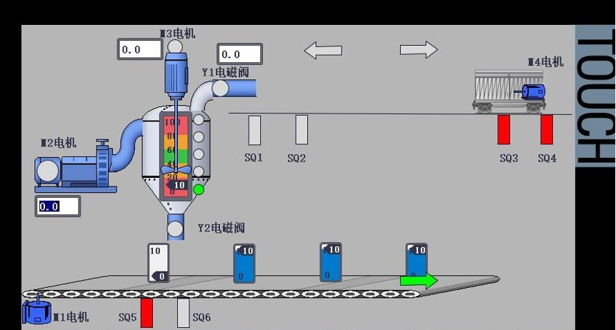

# 场景设定

设定是一个果汁制造工厂的流水线，由网兜运送水果浸入清洗池清洁，运送至水果检验机检验，然后运送至榨汁机榨汁，由小车运送鲜果榨汁，向过滤杀菌器添加鲜果榨汁，当过滤杀菌器中没有液体时，M4电机控制小车左行将鲜果榨汁填充到容器中并返回原点，M2电机可控制过滤杀菌勾兑等过程。M1电机控制传送带的传输，大罐容器向小瓶容器灌输液体，灌满一个，皮带进行传输，灌装下一个，灌满的小瓶通过传送带运送至包装环节。

