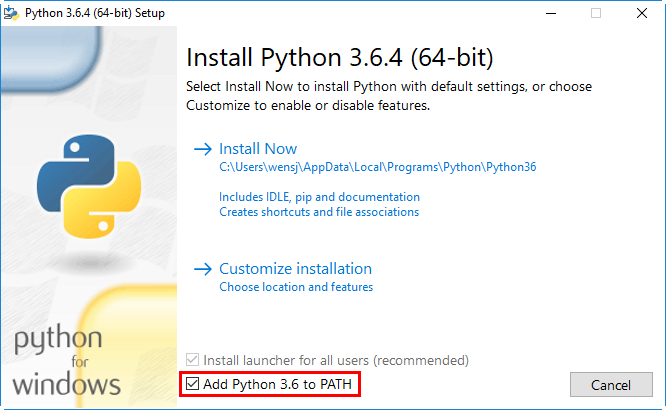

# Window 平台安装 Python

以下为在 Window 平台上安装 Python 的简单步骤。

打开 WEB 浏览器访问 https://www.python.org/downloads/windows/ ，一般就下载 executable installer，x86 表示是 32 位机子的，x86-64 表示 64 位机子的。

按 **Win+R** 键，输入 cmd 调出命令提示符，输入 python:

